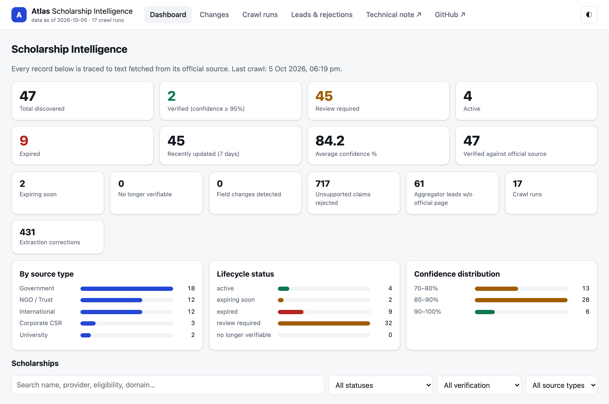
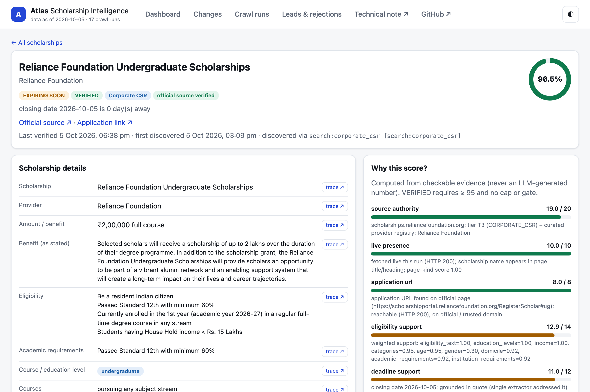
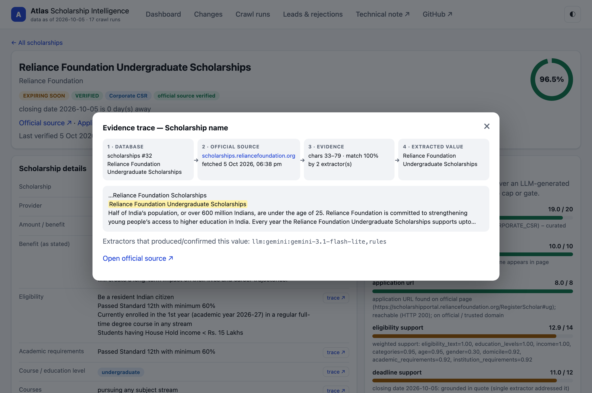

# Atlas Scholarship Intelligence

**Live dashboard:** https://edxso-scholarship-intelligence.vercel.app/

**Technical report (3 pages):** [Open the PDF on the live site](https://edxso-scholarship-intelligence.vercel.app/report) or [view the committed copy](output/pdf/Edxso_Scholarship_Intelligence_Technical_Report.pdf)

**Source note:** [Read the methodology](docs/TECHNICAL_NOTE.md)

An evidence-grounded crawler for scholarship opportunities available to Indian students. It discovers pages beyond fixed programme URLs, extracts structured facts, checks each claim against a stored official-source snapshot, computes confidence, and maintains a searchable SQLite repository. The Vercel site serves a read-only snapshot. Crawling runs locally or in GitHub Actions.

## What is actually in the submitted snapshot

Snapshot: **5 October 2026**. Run the audit command below for the current counts.

| Assignment measure | Observed | Minimum |
|---|---:|---:|
| Scholarship records | 47 | 20 |
| Records linked to fetched, classified official sources | 47 | 15 |
| Confidence at least 95% | 2 | 10 |
| Source categories | 5 | 3 |
| Observed official-source field changes | 0 | 2 |
| Expired or stale records | 9 | 2 |

The two unmet measures are visible rather than filled with artificial data. Hundreds of differences caused by later extraction or validation changes are marked **EXTRACTION CORRECTION**; they are not counted as website changes. A real field change is recorded only when a newly fetched official page differs from the previous snapshot and the grounded field value changes. More scheduled crawls can discover such changes over time, but none are claimed in this snapshot. The 95% gate is deliberately strict: missing official deadlines, incomplete eligibility evidence, or a single extractor keep a record at **REVIEW REQUIRED**.

## Inspect the working result

1. Open the [live dashboard](https://edxso-scholarship-intelligence.vercel.app/). Search or filter the records and open a scholarship.
2. Inspect **Official source**, **Why this score?**, **Change history**, and a field's **trace** button. The trace connects the stored value to a quote and character offsets in a fetched page.
3. Review the committed [SQLite database](data/atlas.db) or [CSV and JSON exports](data/sample/). The JSON export includes evidence and score components.
4. Inspect [crawl runs](https://edxso-scholarship-intelligence.vercel.app/#/runs), [unresolved leads](https://edxso-scholarship-intelligence.vercel.app/#/leads), and [the change feed](https://edxso-scholarship-intelligence.vercel.app/#/changes). Use the audit command to verify the assignment counts directly from SQLite.

## How data is obtained

~~~text
Official hubs + topical searches + provider-domain searches
       ↓
Ranked discovery frontier; aggregator/search results are leads only
       ↓
Official-domain classifier → polite HTML/PDF fetch → stored page text
       ↓
Rules + optional Gemini/Groq/Ollama propose values with exact quotes
       ↓
Grounding checks quote offsets and whether the quote supports the value
       ↓
Nine-component deterministic score + hard caps + lifecycle status
       ↓
SQLite records, evidence, rejected claims, crawl runs and field history
       ↓
FastAPI dashboard and CSV/JSON exports
~~~

Starting points are in [config/seeds.yaml](config/seeds.yaml); source classification rules and provider registry are in [config/domains.yaml](config/domains.yaml). These files contain sources and search terms, not a manually written scholarship dataset. Search snippets and aggregators must resolve to a primary provider, government or institution page before a record is accepted. Missing facts appear as **Not specified**; the model cannot assign confidence.

The database stores programme details, benefit, application URL, eligibility, education level, income, age, category, domicile, dates, status, confidence, last verification time and field evidence. Key tables: **scholarships**, **pages**, **field_evidence**, **confidence_breakdown**, **changes**, **status_history**, **rejected_extractions**, **unresolved_leads**, and **crawl_runs**. Schema: [scholarship_intel/db.py](scholarship_intel/db.py).

## Run locally

Python 3.11+ is recommended.

~~~bash
python3 -m venv .venv
source .venv/bin/activate
pip install -r requirements-crawler.txt
cp .env.example .env
python -m scholarship_intel run --max-pages 80
python -m scholarship_intel serve --port 8010
~~~

Open http://127.0.0.1:8010/. The crawler works with rules alone; optional free-tier Gemini and Groq keys improve independent extraction. Add them to your local **.env** as GEMINI_API_KEY and GROQ_API_KEY. Ollama is an optional local provider. Never commit **.env**. The live Vercel dashboard needs no model key because it only reads the committed database.

~~~bash
python -m scholarship_intel list
python -m scholarship_intel audit
python -m scholarship_intel export --out data/sample
python -m scholarship_intel snapshot
python -m pytest -q
~~~

To rebuild the visual report after refreshing the database, install **requirements-report.txt**, capture current dashboard screenshots, and run **python scripts/build_report.py**. The builder reads the live SQLite snapshot and stops if its fixed narrative counts no longer match.

A subsequent **run** re-fetches known official URLs before discovering new candidates. Use **--reverify-only** for a focused refresh, **--no-search** to crawl seeds and links without search, or **--offline** to inspect the cached pages without network access. **--as-of YYYY-MM-DD** changes the date used for lifecycle calculations, not source evidence.

## Updates and hosting

[.github/workflows/crawl.yml](.github/workflows/crawl.yml) schedules a crawl, exports records, checkpoints SQLite, and commits the refreshed snapshot. A Git-connected Vercel deployment then serves the new commit through [app.py](app.py). Vercel is read-only; its request functions do not run the crawler or preserve database writes. To enable model cross-checking in scheduled runs, configure fresh GEMINI_API_KEY and/or GROQ_API_KEY values as **GitHub Actions secrets**. Without them, scheduled extraction uses rules and cannot meet the two-extractor verification gate.

A local refresh can be published with:

~~~bash
python -m scholarship_intel run
python -m scholarship_intel export --out data/sample
python -m scholarship_intel snapshot
git add data/atlas.db data/sample
git commit -m "Refresh crawler snapshot"
git push
~~~

## Technical choices and limits

- **Python, requests, BeautifulSoup, pypdf, optional Playwright:** polite fetching with robots checks, per-domain pacing, retries, HTML/PDF parsing, and a browser fallback for JavaScript pages.
- **Rules plus optional free LLMs:** extraction proposals are checked against exact source passages. A claim with no matching quote or unsupported value is rejected and logged.
- **SQLite:** inspectable local data, evidence offsets, score components, and append-only history.
- **FastAPI and plain JavaScript:** lightweight public read-only dashboard and trace view.
- **Honest lifecycle:** expired deadlines and failed re-verification are distinct from a verified active application window. A temporary network error does not by itself prove removal.
- **Known gaps:** many official pages omit a current closing date or enough eligibility detail for 95%; scanned PDFs need OCR; free model endpoints can rate limit. The current snapshot has no observed source field changes.

See the [technical report](output/pdf/Edxso_Scholarship_Intelligence_Technical_Report.pdf) and [confidence methodology](docs/CONFIDENCE.md) for the score and evidence rules. This repository includes the working application, source, setup, database, sample exports, dashboard and technical note requested for the assignment.
